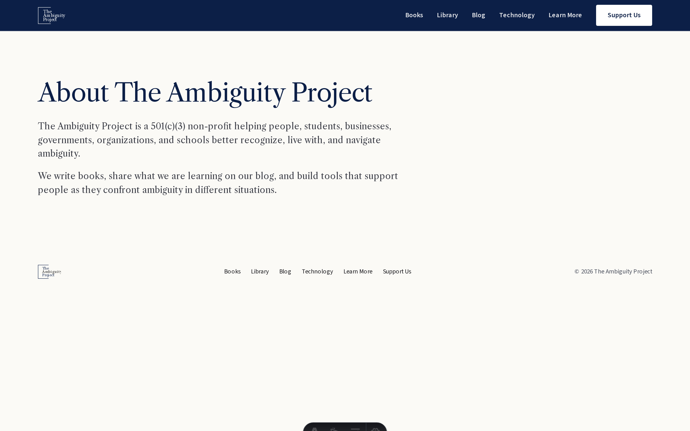
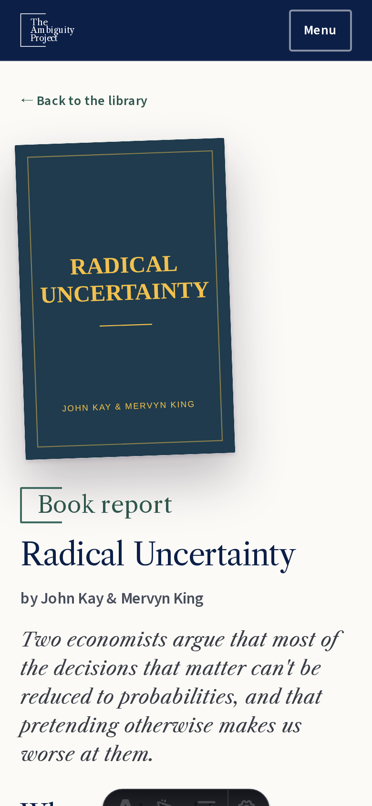
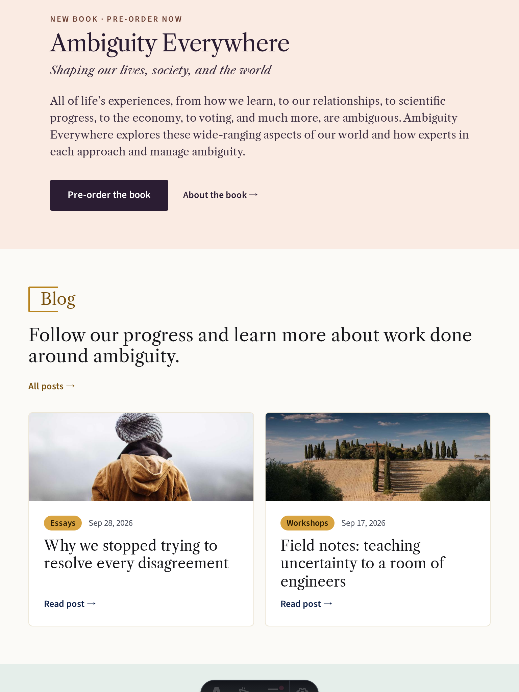
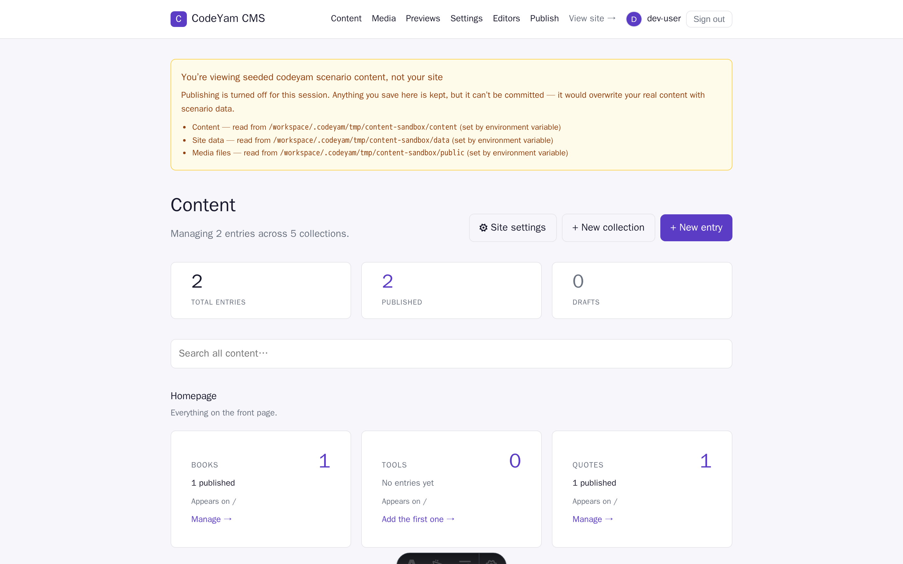
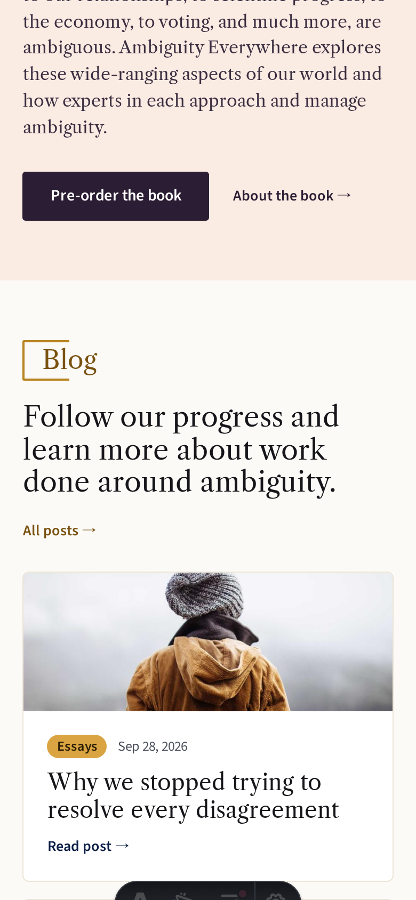
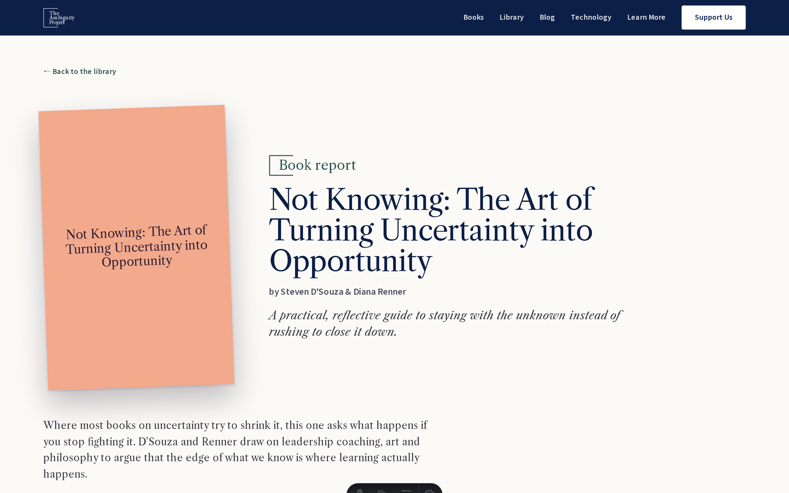
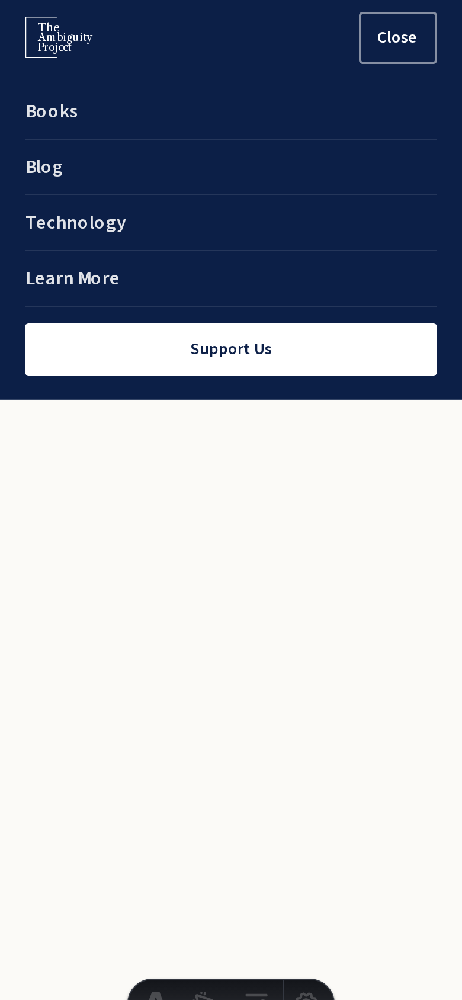
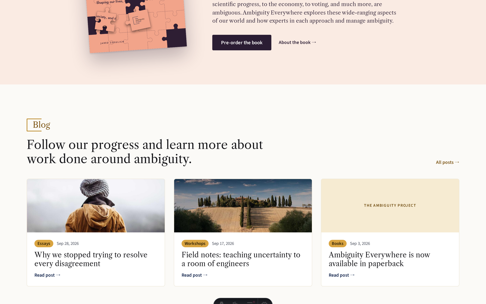

# The Ambiguity Project website

The site for [The Ambiguity Project](https://jaredcosulich.github.io/ambiguity-project/),
a 501(c)(3) non-profit helping people better recognize, live with, and navigate
ambiguity. It is a static [Astro](https://astro.build) site, edited through
CodeYam CMS at `/admin` and published to GitHub Pages.

## Develop

```bash
npm install
npm run dev        # http://127.0.0.1:4321 (CMS at /admin)
npm run build      # type-check + static build into dist/
npm run test       # unit tests (vitest + jsdom)
npm run sync:substack  # refresh src/data/substackPosts.json from the Substack feed
```

## Layout

```
design/mockup/       # the original hand-written mockup — the visual source of truth
public/              # favicon, apple-touch-icon, images (served as-is)
src/
  components/        # SiteHeader, SiteFooter and their parts, one component per file
  content/config.ts  # content collections: pages, books, tools, quotes, library (reviewed books)
  data/              # editable JSON: settings.json, nav.json, cms.json, collections.json
  layouts/           # BaseLayout: <head>, fonts, header, footer
  lib/               # site data loading, withBase(), nav links, mobile menu
  pages/             # routes: the home page, /<slug> pages, /library and /library/<slug> book reports
  styles/            # tokens.css (design tokens) and global.css (shared rules)
```

## Editable site data

Site-wide text and links are content, not markup. `src/data/settings.json`
(title, description, footer text, Substack URL) and `src/data/nav.json` (the
header and footer menu; the last item is the header's button) are loaded by
`src/lib/site.ts`. Changing them is a commit the CMS makes, never a source
change. See `CMS_SETUP.md`.

## Blog

Posts are written in Substack. `scripts/sync-substack.mjs` reads the feed at
`<Substack URL>/feed` and writes the newest posts to
`src/data/substackPosts.json`, which the home page's Blog section shows (the
latest three). The file is generated, so don't edit it by hand. Every deploy
re-syncs before building, and a daily scheduled deploy picks up new posts. See
`DEPLOY_SETUP.md`.

## Deploy

Every push to `main` builds and publishes through
`.github/workflows/deploy.yml`. Internal links go through `withBase()` so the
site works under the `/ambiguity-project/` subpath today and at the root of a
custom domain later. See `DEPLOY_SETUP.md`.

<!-- codeyam:run-and-edit:start d=3a7aa108d126 -->
## Develop this project with codeyam-editor

This project is built with [codeyam-editor](https://codeyam.com) — code and runnable data scenarios are authored side by side against a live preview.

```bash
# Clone the repo
git clone https://github.com/jaredcosulich/ambiguity-project && cd ambiguity-project

# Install codeyam-editor
npm install -g @codeyam-editor/codeyam-editor@latest

# Launch the editor (split-screen terminal + live preview)
codeyam-editor start
```
<!-- codeyam:run-and-edit:end -->

<!-- codeyam:scenario-gallery:start d=66c479997231 -->
## Scenario gallery

States captured as runnable scenarios with codeyam-editor:

### About Page



The About page that the Learn More button opens, rendered from the pages collection with the shared header and footer.

### Book Page - Radical Uncertainty Mobile



A book report at phone width: the cover stacks above the title, author and summary, with the back link on top.

### Home - Blog Latest Posts Tablet



At tablet width the Blog section shows two cards side by side and hides the third, matching the mockup's two-column layout.

### Admin Dashboard - Pages And Site Settings



CodeYam CMS dashboard at /admin showing the pages collection and the Site settings entry point.

### Home - Blog Latest Posts Mobile



At phone width the Blog section stacks the newest posts in a single column, with the All posts link wrapping under the heading.

### Book Page - No Cover Long Title



A book with no cover image and a long title: the large salmon title card stands in for the cover and the long title wraps beside it.

### Home Shell - Mobile Menu Open



Home page at mobile width after tapping Menu: the nav drops down as divided rows with a full-width Support Us button and the toggle reads Close.

### Home - Blog Latest Posts



Home page scrolled to the Blog section with ten synced Substack posts: only the newest three show as cards, one without a cover image falls back to the ochre site-name panel.
<!-- codeyam:scenario-gallery:end -->
